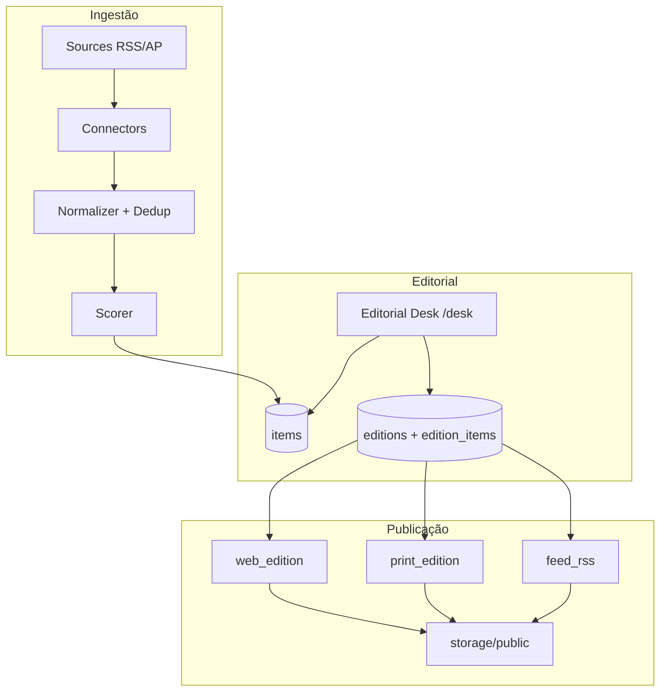

# Fedizine — Como o sistema funciona

Referência técnica e visual: stack, arquitetura, fluxo de dados, renderização e identidade de interface.

**Versão do app:** `0.0.1` (Pablo Murad · pablomurad@pm.me)  
**UI pública e desk:** inglês

---

## 1. O que é

Fedizine é uma **pequena prensa editorial** para a web pessoal no Fediverso. Não é rede social nem agregador infinito.

Entrada: posts, fotos, vídeos, leituras e links via **RSS/Atom** e **ActivityPub**.  
Saída:

1. **Webzine** — HTML com URL estável, arquivo, slash pages e RSS.
2. **PDF A5** — impressão via WeasyPrint.

Princípio: *a timeline é contínua; o zine é uma edição.*

---

## 2. Stack

| Camada | Tecnologia |
|--------|------------|
| Linguagem | Python 3.12+ |
| HTTP / API | FastAPI + Uvicorn |
| Templates | Jinja2 (público, admin, print, RSS) |
| ORM / migrações | SQLAlchemy 2 + Alembic |
| Banco | PostgreSQL 16 |
| Filas | Celery 5 + Redis 7 |
| HTTP cliente (fediverso) | httpx |
| Feeds | feedparser |
| PDF | WeasyPrint |
| Sanitização HTML | bleach |
| CLI | Typer (`fedizine`) |
| Deploy local | Docker Compose |

Sem frontend SPA: HTML server-rendered, HTMX e Alpine.js só no admin para interações leves.

---

## 3. Serviços Docker

```text
app        → FastAPI (porta 8000 interna, HOST_PORT no host)
worker     → Celery worker (collect, score, build, pdf, publish)
scheduler  → Celery beat (coleta diária 06:00)
postgres   → dados relacionais
redis      → broker e backend de resultados Celery
```

Volume `./storage` montado em `/data` no container (`PUBLIC_PATH`, `MEDIA_PATH`, etc.).

---

## 4. Arquitetura lógica



### Camadas no código

| Pasta | Papel |
|-------|--------|
| `app/web/` | Rotas FastAPI: `public.py`, `admin.py`, `health.py` |
| `app/services/` | Regras de negócio: coleta, edição, pontuação, publicação |
| `app/connectors/` | RSS e ActivityPub → dict bruto normalizado |
| `app/editorial/` | Normalização, dedup, scoring, copy (meses, seções) |
| `app/renderers/` | Jinja offline: web, PDF, RSS; `common.py` compartilhado |
| `app/models/` | SQLAlchemy: User, Source, Item, Edition, EditionItem, Zine, Job |
| `app/workers/` | Tasks Celery |
| `templates/` | `public/`, `admin/`, `print/`, `feeds/`, `partials/` |
| `static/css/` | `site.css`, `desk.css`, `paper-tokens.css`, `print-a5.css` |

---

## 5. Modelo de dados (resumo)

- **User** — editor; sessão no desk via cookie assinado.
- **Source** — fonte federada (URL, plataforma, handle, config JSON).
- **Item** — fragmento coletado: conteúdo, mídia, score, status (`candidate` → `selected` / `featured` / `ignored`), `suggested_section`.
- **Edition** — issue mensal (`period_year_month` = `YYYY-MM`), status `draft` → `ready` → `published`.
- **EditionItem** — liga Item à Edition com seção e ordem.
- **Zine** — metadados de publicação (caminhos web/PDF, timestamps).
- **Job** — registro de trabalhos de coleta.

Multi-usuário no schema; MVP assume um editor padrão (`DEFAULT_USER_SLUG` no `.env`).

---

## 6. Conectores e Fediverso

Registro de plataformas: `config/platform_registry.yml`.

| Connector | Protocolos típicos |
|-----------|-------------------|
| `rss.py` | RSS, Atom |
| `activitypub.py` | ActivityPub (outbox, actor, webfinger) |

Plataformas mapeadas (mastodon, pixelfed, lemmy, peertube, bookwyrm, …) reutilizam o connector ActivityPub ou RSS conforme o cadastro.

**ActivityPub:** resolve actor → outbox → páginas com `orderedItems` ou `items`; `next` pode ser URL ou objeto com `id`. Tipos aceitos: Note, Article, Image, Video, Event, Document.

**Segurança de URL:** `url_validator` exige esquemas permitidos e bloqueia resolução para IPs privados quando configurado.

---

## 7. Pontuação e seções

`app/editorial/scorer.py` atribui score heurístico (conteúdo próprio, mídia, thread, links, alt text, tags, engajamento, recência, tamanho do texto).

Seções padrão (inglês): Fragments, Photos, Readings, Videos, Agenda, Communities, Commented links — mapeadas por `content_type` em `SECTION_MAP`.

Limiar editorial: `EDITORIAL_SCORE_THRESHOLD` (padrão 50).

---

## 8. Publicação

`publish_service.publish_edition`:

1. Renderiza HTML da edição → `storage/public/{YYYY-MM}/index.html`
2. Gera PDF → `storage/public/{YYYY-MM}/zine.pdf`
3. Atualiza `feed.xml` na raiz pública
4. Re-renderiza home → `storage/public/index.html`
5. Marca edition `published`, atualiza `Zine`

Rotas dinâmicas em `public.py` leem do banco edições publicadas; arquivos estáticos também ficam disponíveis sob `/files/` e paths diretos do mount público.

---

## 9. Rotas HTTP

### Público

| Rota | Handler |
|------|---------|
| `GET /` | Home |
| `GET /archive/` | Arquivo |
| `GET /colophon/` | Colofão |
| `GET /feed.xml` | RSS |
| `GET /about/`, `/now/`, `/uses/`, `/links/` | Slash pages |
| `GET /{YYYY-MM}/` | Edição publicada |
| `GET /{YYYY-MM}/zine.pdf` | PDF |

### Editorial Desk (`/desk`, autenticado)

| Rota | Função |
|------|--------|
| `/desk/login` | Sessão |
| `/desk/` | Dashboard do mês |
| `/desk/sources` | CRUD fontes + collect |
| `/desk/fragments` | Curadoria |
| `/desk/issues` | Montagem |
| `/desk/proof` | PDF + publish |

### Estático

- `/static/css/*` — folhas de estilo
- `/assets/*` — logo, favicon
- `/favicon.ico` — atalho para favicon

---

## 10. Aparência visual

Duas “camadas” visuais distintas.

### Site público — `static/css/site.css`

Estética **Fedizine**: webzine colorido, editorial, inspirado em prensa indie e fanzine digital.

- Fundo quente (`--bg: #fff7f0`), tinta escura (`--ink`)
- Acentos fortes: pink, blue, yellow, green, purple (cards e botões)
- Sombras duras (`box-shadow` offset) estilo carimbo/recorte
- Tipografia: system UI sans; hierarquia clara na home e na edição
- Componentes: `press-hero`, `hero-issue-mark`, `card-pink/yellow/blue`, `fragment-card`, `source-tag`, `nav-pills`, `slash-list`
- Layout responsivo; leitura em coluna na página de edição
- Idioma do conteúdo UI: **inglês**

Templates principais: `templates/public/home.html`, `edition.html`, `archive.html`, partials `site_header`, `site_footer`, `fragment_card`, `source_tag`.

### Editorial Desk — `paper-tokens.css` + `desk.css`

Ambiente de trabalho **calmo e legível**, papel e tinta.

- Tokens em `paper-tokens.css`: `--paper`, `--ink`, serifas para títulos, mono para meta
- `desk.css`: layout sidebar + main (`desk-layout`, `desk-sidebar`, `desk-main`)
- Cartões de fragmento reutilizam `.fragment-card` e `.source-tag`
- Botões `.btn` / `.btn-secondary` discretos; formulários em `.form-card`
- HTMX/Alpine no `admin/base.html` para fluxo sem SPA

### PDF — `static/css/print-a5.css` + `templates/print/zine_a5.html`

Paginação A5, tipografia de impressão, seções e fragmentos em ordem editorial.

---

## 11. Renderização Jinja

Três ambientes offline em `app/renderers/`:

- `web_edition.py` — home, arquivo, edição, slash pages; escreve snapshots
- `print_edition.py` — HTML → PDF via WeasyPrint
- `feed_rss.py` — `templates/feeds/rss.xml`

`common.py` centraliza `make_jinja_env`, filtro `month_name` e `group_edition_by_section`.

O desk usa `Jinja2Templates` do FastAPI em `app/web/templates.py` (rotas ao vivo, não snapshot).

---

## 12. Configuração

Variáveis em `.env` (modelo em `.env.example`):

- `APP_PUBLIC_URL` — base para links no RSS e redirects
- `APP_SECRET_KEY` — sessão do desk
- `DATABASE_URL`, `REDIS_URL`, paths de storage
- `DEFAULT_USER_*` — seed do primeiro editor via CLI
- `EDITORIAL_SCORE_THRESHOLD`, `COLLECTION_INTERVAL_HOURS`, `COLLECT_TIMEOUT_SECONDS`
- `ALLOWED_URL_SCHEMES`, `BLOCK_PRIVATE_IPS`

---

## 13. Estrutura de diretórios (raiz)

```text
app/                 código Python
templates/           Jinja (public, admin, print, feeds, partials)
static/css/          estilos
assets/              logo, favicon
config/              platform_registry.yml
migrations/          Alembic
storage/public/      HTML/PDF publicados (gitignored exceto .gitkeep)
storage/media/       mídia local (futuro)
scripts/             entrypoint Docker
docker-compose.yml
pyproject.toml
```

---

## 14. CLI `fedizine`

| Comando | Efeito |
|---------|--------|
| `create-user` | Primeiro editor |
| `collect` | Coleta fontes |
| `score` | Pontua fragmentos |
| `build-edition` | Monta issue |
| `build-pdf` | Só PDF |
| `publish` | Web + PDF + RSS + home |

Equivalente às ações do desk, útil para automação.

---

## 15. O que ficou de fora do MVP

- Cadastro público (`ENABLE_PUBLIC_SIGNUP=false`)
- Assistente de IA (`ENABLE_AI_ASSISTANT=false`)
- Edição visual WYSIWYG de slash pages (texto hoje em `SLASH_PAGES` no código)
- API JSON pública além do RSS

---

Para o passo a passo de uso diário, veja [uso.md](uso.md).  
Para instalação mínima, veja [README.md](README.md).
